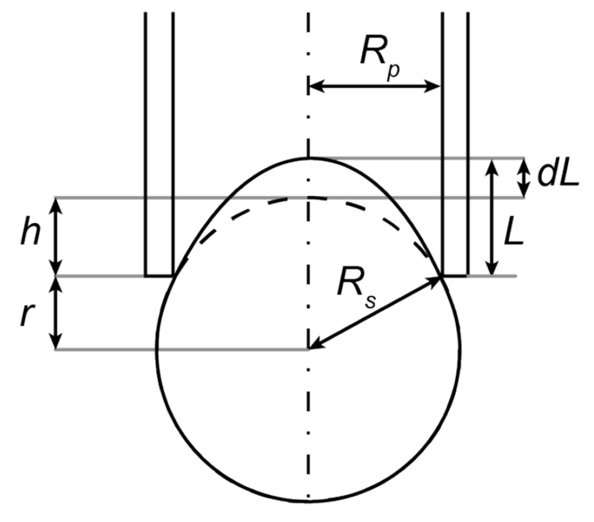

<div align="center">
  
  <h1>Particle Distortion Analysis (PDA)</h1>
</div>

## Overview
Particle Distortion Analysis (PDA) is software for the analysis of microaspiration (or ion pipette aspiration) data.
The source code, along with instructions, documentation and a Windows executable, is available on Github at [github.com/HaigBishop/particle-distortion-analysis](https://github.com/HaigBishop/particle-distortion-analysis)

## Video Tutorial
There is a video explanation of how to use the application [here on YouTube](https://youtu.be/fIiAgqGtd_4)

## Background/Theory
The purpose of this software is to select events from a microaspiration experiment and track the distortions. 

An experiment is a video of a microaspiration experiment which may be several minutes long and may contain any number of events. Electrical data is also often recorded during an experiment. This electrical signal (likely as a .tdms files) can be imported and synced with the video.

Events are when a particle is aspirated into the pipette tip, therefore the selection of events is simply selecting the range of frames in an experiment where the particle is aspirated. The first frame of an event is assumed to have 0 distortion, meaning the particle is a perfect circle.

Distortions are when the particle is deformed by the pipette tip as they are aspirated (see figure below). In the first frame of an event, the particle is a perfect circle, so dL (see figure) is 0. As the particle is aspirated, it is deformed by the pipette tip, and dL increases. 

After tracking the distortion, the software allows for the export of the data for all events as CSV files. Most importantly, the CSV file contains a dL column (in units of pixels). This data can be automatically stored in a  JSON file for each experiment, which holds both the electrical signal and distortion data.

<div align="left">
  
</div>

## Usage

### Event Selection
Import experiment(s) as video files (and optionally .tdms files), then select the exact frames where events occur. These are exported as a JSON file for each experiment.

##### Controls
- **S**: Add event start or stop.
- **R**: Remove the current event if the slider is on an event.
- **+**: Zoom in.
- **-**: Zoom out.
- **0**: Reset zoom.
- **Left Click**: Set the current frame to the click position.
- **Scroll Up**: Zoom In
- **Scroll Down**: Zoom Out

### Distortion Detection
Verify the position and size of the particle, as well as the pipette tip in the first frame of the event(s). 

##### Controls
- **Z**: Zoom into the particle.
- **X**: Hide lines and circles.
- **Arrows or WASD**: Move the particle.
- **Shift + Arrows or WASD**: Move the pipette tip.
- **Left Click**: Move the particle to the clicked position.
- **Scroll Up**: Decrease the particle radius.
- **Scroll Down**: Increase the particle radius.

### Distortion Tracking
Verify the position of the distortion in each frame of the event(s). This distortion is exported as a CSV file for each event (and optionally the experiment JSON file is updated with the distortion data).

##### Controls
- **Z**: Zoom into the particle.
- **X**: Hide lines and circles.
- **Up/Down Arrows or W/S**: Move the distortion.
- **Left/Right Arrows or A/D**: Previous/Next frame.
- **Left Click**: Set the current frame based on the click position on the thumbnail bar.
- **Scroll Up**: Zoom In
- **Scroll Down**: Zoom Out

## Installation
1. Run using python in a conda environment
```
conda create -n pda_env python=3.13 -y
conda activate pda_env
conda install -c conda-forge kivy opencv numpy scipy moviepy plyer pywin32 pandas -y
pip install nptdms
git clone https://github.com/HaigBishop/particle-distortion-analysis.git
cd particle-distortion-analysis
python particle-distortion-analysis.py
```
2. Run using the Windows executable
(Look for the .exe file in the lastest release on the [GitHub releases page](https://github.com/HaigBishop/particle-distortion-analysis/releases))

## Dependencies
(see requirements.txt)
#### Python 3.13.1
#### Packages (Conda)
- kivy (2.3.1)
- opencv (4.11.0.86)
- numpy (2.2.2)
- scipy (1.15.1)
- moviepy (1.0.3)
- plyer (2.1.0)
- pywin32 (308)
- pandas (2.2.3)
#### Packages (Pip)
- nptdms (1.10.0)

## Files and Development Descriptions
There are several Python files which make this program, which are each described.
There are also some images, fonts, a .kv file and a .txt file.
#### Main:
  -  particle-distortion-analysis.py  -  the main file for this application
#### Tracking functions:
  -  tracking.py  -  detects and tracks the pipette, particle and distortion
#### Graphic User Interface (using Kivy)
  -  pda.kv  -  contains the GUI styling for the entire application
  -  ie1.py  -  contains the functionality for the Importing Experiments screen
  -  ie3.py  -  contains the functionality for the Selecting Events screen
  -  td1.py  -  contains the functionality for the Importing Events screen
  -  td2.py  -  contains the functionality for the Detecting Distortions screen
  -  td3.py  -  contains the functionality for the Tracking Distortions screen
  -  popup_elements  -  contains popup GUI elements
#### Other:
  -  file_management  -  contains code for dealing with files

## License

MIT License
(see LICENSE.txt)

## How to Cite PDA

The only way to site PDA is to cite this Github repository. See the CITATION.cff file above and "Cite this repository".

**APA:**
Bishop, H. (2025). Particle Distortion Analysis (Version 1.0.2) [Computer software]

**BibTeX:**
@software{Bishop_Particle_Distortion_Analysis_2025,
author = {Bishop, Haig},
month = jan,
title = {{Particle Distortion Analysis}},
version = {1.0.1},
year = {2025}
}

## Author and Acknowledgments

Please feel free to contact me if you have any questions, feedback, or requests
  -  Author:         Haig Bishop
  -  Email:          haig.bishop@pg.canterbury.ac.nz
  -  Organisation:   University of Canterbury, New Zealand

A big thank you to Ashley Garrill, Volker Nock, and Ayelen Tayagui at UC for supporting this project!
