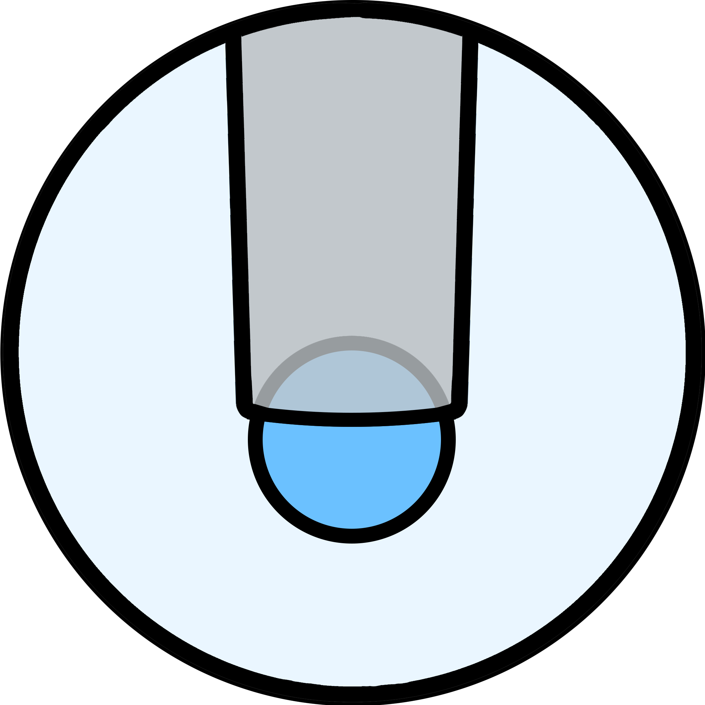

  
  <h1>Particle Distortion Analysis (PDA)</h1>

## Overview
Particle Distortion Analysis (PDA) is software for the analysis of microaspiration (or ion pipette aspiration) data.
The source code, along with instructions, documentation and a Windows executable, is available on Github at [github.com/HaigBishop/particle-distortion-analysis](https://github.com/HaigBishop/particle-distortion-analysis)

## Features
- X

## Installation

## Usage
X

## License
X

